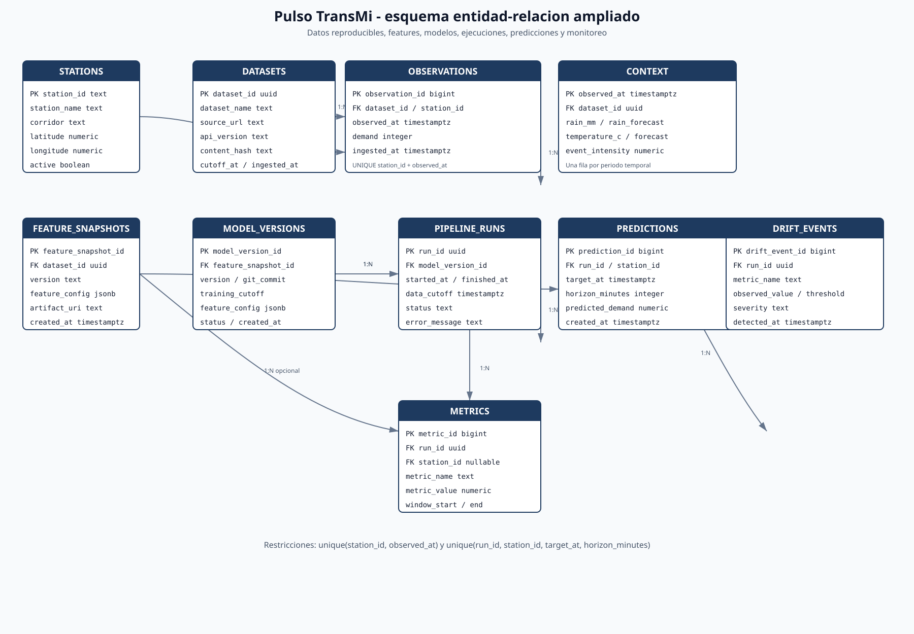
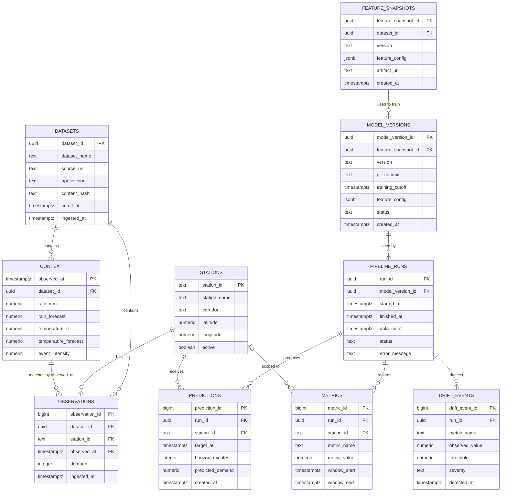

# Esquema de base de datos

## Objetivo

Este esquema soporta el ciclo mínimo de MLOps del proyecto:

1. conservar estaciones, observaciones y contexto;
2. registrar fuentes y cortes de datos reproducibles;
3. versionar features y modelos;
4. auditar ejecuciones del pipeline;
5. guardar predicciones por estación y horizonte;
6. medir desempeño y detectar drift.

La API pública continúa siendo la fuente de ingesta. La base de datos almacena
el estado operativo y la trazabilidad del proyecto estudiantil.

La implementación PostgreSQL para Supabase está en
[`supabase/migrations/20260916210000_create_pulso_schema.sql`](../supabase/migrations/20260916210000_create_pulso_schema.sql).
La migración crea las diez tablas, sus restricciones, índices y políticas RLS
de lectura para usuarios autenticados.

## Diagrama entidad-relación



También puede renderizarse este modelo con Mermaid:



## Entidades

| Entidad | Responsabilidad |
|---|---|
| `stations` | Catálogo geográfico estable de estaciones. |
| `datasets` | Registro de cada corte descargado y su hash de contenido. |
| `observations` | Demanda observada por estación y periodo de 15 minutos. |
| `context` | Clima y eventos asociados a cada periodo temporal. |
| `feature_snapshots` | Configuración y artefacto reproducible de features. |
| `model_versions` | Versionado del modelo, commit, cutoff y configuración de features. |
| `pipeline_runs` | Auditoría de cada ejecución de ingesta, entrenamiento o predicción. |
| `predictions` | Predicciones generadas por estación, fecha objetivo y horizonte. |
| `metrics` | Accuracy, WAPE y otras métricas por ejecución, opcionalmente por estación. |
| `drift_events` | Alertas de data drift o degradación del desempeño. |

## Relaciones y decisiones

- Una estación tiene muchas observaciones y muchas predicciones.
- Un `dataset` representa un corte concreto de la API y puede contener muchas
    observaciones y filas de contexto.
- Un registro de `context` se identifica por `observed_at` y se comparte entre
  las observaciones de todas las estaciones de ese periodo.
- `observations` debe tener una restricción única sobre
  `(station_id, observed_at)` para evitar duplicados de ingesta.
- Una versión de modelo puede utilizarse en muchas ejecuciones, pero cada
  ejecución usa una única versión.
- Un `feature_snapshot` identifica la transformación exacta usada para entrenar
    una o varias versiones del modelo.
- Una ejecución puede producir muchas predicciones y registrar muchas métricas.
- Una ejecución puede detectar múltiples eventos de drift.
- `metrics.station_id` puede ser `NULL` para métricas globales y debe tener un
  valor para métricas específicas de estación.
- `predictions` debe tener una restricción única sobre
  `(run_id, station_id, target_at, horizon_minutes)`.
- `horizon_minutes` permite representar los cuatro horizontes solicitados sin
  crear una tabla adicional.

## Índices mínimos

```sql
create unique index observations_station_time_uq
    on observations (station_id, observed_at);

create index observations_time_idx
    on observations (observed_at);

create index observations_dataset_idx
    on observations (dataset_id);

create unique index datasets_name_cutoff_uq
    on datasets (dataset_name, cutoff_at);

create unique index feature_snapshots_version_uq
    on feature_snapshots (version);

create index predictions_station_target_idx
    on predictions (station_id, target_at);

create unique index predictions_run_station_target_horizon_uq
    on predictions (run_id, station_id, target_at, horizon_minutes);

create index metrics_run_idx
    on metrics (run_id);

create index drift_events_run_idx
    on drift_events (run_id);
```

## Flujo operativo

```text
API publica datos ---> datasets ---> observations + context
                      |
                  feature_snapshots
                      |
                  model_versions
                      |
                  pipeline_runs ---> predictions
                   |        \
                   v         v
                metrics   drift_events
```

El diseño cubre un pipeline incremental con trazabilidad de datos, features,
modelos, predicciones, métricas y alertas. Una tabla de `submissions` podría
agregarse después si la competencia exige registrar envíos a un leaderboard.
